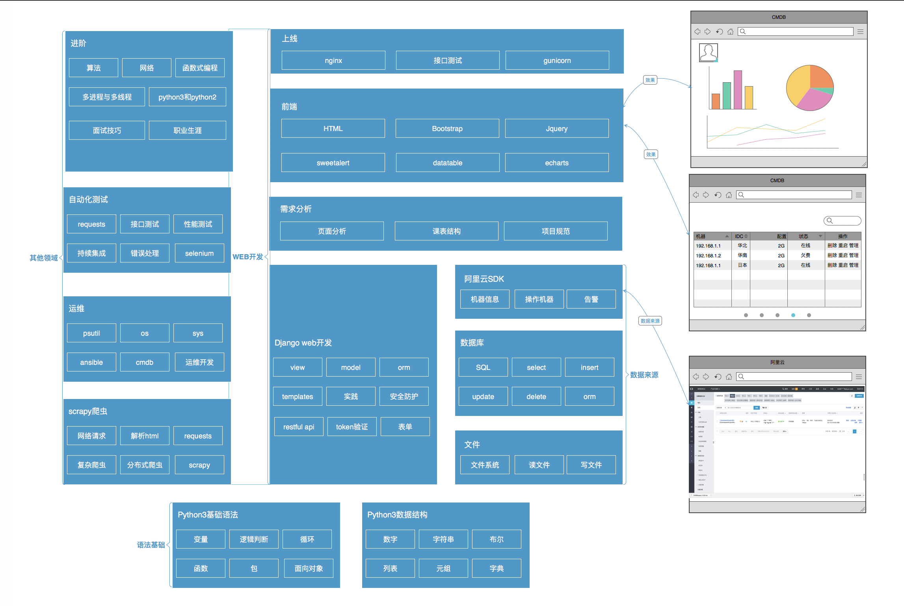

# 实战最新课程

* 更新python3
* django

### 新课程的亮点
1. 更新为python3
2. flask升级为django
3. 可视化的保留一个psutil获取信息+内存显示的
4. 用户权限改为token验证
5. cmdb这里加入阿里云的sdk简单使用 获取阿里云的机器信息
6. 增加restful api
7. requests给cmdb做接口测试
8. gunicorn+nginx部署
9. scrapy+redis分布式爬虫
10. 调用ansible的api
11. 调用zabbix的api

### 实战班课程升级啦

* 全面更新Python3
* 更新django web框架
* 全新实战项目

### 课程结构图

### 面向学员
* 熟练使用计算机
* 对Windows、Linux 有一点了解
* 想学习和使用python
* 想学习web开发
* 学习自动化测试

## 课程表
## Python 基础部分
###（第一天）基础语法
* Python 发展历史和语言特性
* Python2和Python3之争
* Python 环境搭建及虚拟环境管理
* 第一个 Python 程序
* Python 四则运算
* 变量是什么
* Python 字符串
* Python 布尔值
* 用户输入 （input、raw_input）
* 流程控制
    * 缩进
    * if..else 条件语句
    * for、while 循环语句
    * break continue 中断语句」
* 作业使用github管理，介绍github和注册帐号
* 如何使用git提交作业
* 作业：输入用户名和密码，根据输入结果判断，并返回相应的提示信息
    * 判断用户是否存在，如果不存在直接返回错误
        * 如果存在，则验证密码，对密码长度也有限制
        * 密码错误，重新输入
        * 连续输错三次，推出
        * 密码正确，成功登录
    * 如果不存在，直接退出

###（第二天）列表、元祖和字典
* 列表的定义
* 列表的遍历和切片
* 常用内置函数（max、min、range、len）
* list 方法（append、pop、count ...）
* 列表表达式
* 元组的定义
* tuple 方法（count、index）
* 元组与列表的关系与区别
* 字符串处理（find、join、split、strip、format、replace、index、count ...）
* 字典定义
* 字典增删改查
* 字典和列表的异同
* 作业：统计给定字符串里，出现次数最多的三个

###（第三天）文件处理和函数

* 如何读取文件
* 如何写入文件
* html如何显示表格
* 练习：将第二天作业结果输出一个html文件，在浏览器打开
* 函数的定义
* 函数的返回值
* 函数的参数
* 函数传参

作业1：IP 维度统计 Nginx 日志
作业2：使用函数改造登录注册功能 

###（第四天）Django 入门
* Django介绍
* Django 版 Hello World
* 视图和url配置
* Django模板
* HTML表单
* 前后端传递参数
* 作业：Django基于文件系统的登录系统
    - 用户名密码存储在文件里 user:pwd
    - 密码输入三次报错

###（第五天）数据库
* Mysql介绍
* 常用SQL，建库建表
* SQL增删改查语句
* Django模型
* HTTP的GET和POST
* 项目：使用Django实现web增删改查
* 作业1：基于Django+mysql的 WEB 用户登录注册系统（支持增删查）

## Python Web 项目开发部分

### (第六天)前端基础

* HTML 学习（table、表单、列表 ... 等）
* CSS 简介（盒模型）
* Bootstrap 框架学习
    * 栅格系统
    * 按钮组
    * 表格样式
    * 表单样式
    * 辅助样式
* 前端学习JQuery
    * 查找一个元素（选择器）
    * 操作元素内容（html）
    * 修改元素属性（attr、css）
    * 操作输入框（val）
* 练习：聊天窗效果模拟
* 作业1：基于 MySQL 存储的 WEB 用户登录注册系统
    * 要求使用Bootstrap 样式展现登录和列表

###（第七天）前端应用实战
+ jquery简介和使用
    * jquery核心概念
+ jquery核心模块使用
+ jquery发送异步请求和django交互
    - ajax是什么
    - json是什么
    - Django返回json
+ 常见jquery插件，实现前端效果
    * 模态弹窗
    * sweetalert弹出信息
    * jquery-ui丰富的组件，日期选择、小滑块等
    * datatable美化表格
+ 作业:使用异步ajax+jquery，优化上一天的作业
    - 要求异步，不刷新页面的增删改查

## Web 项目实战部分
###（第八天）实战项目之一cmdb

* Python+Django+Mysql+Jquery+Bootstrap(打通前后端完整流程)
* Django用户登入
    - 登录功能的完善
* 项目CMDB系统
* CMDB系统基础信息分析
* CMDB系统资产表设计
* CMDB系统数据展现
* CMDB系统数据更新
* 目的：完整的前端+后端+数据库的项目
* 项目扩展介绍

###（第九天）Python抽象和常用模块(一)

* 类的基本概念与详解
* 变量与方法
* 作用域与命名空间
* 继承
* 类的抽象、封装、方法与实例化实践
* 面向对象在Django应用的深度理解
* 常用内置模块（sys、os、commands）
* 脚本参数处理（sys.argv）
* 时间的控制(time)
* 网络请求requests库
    - 实现爬虫和调用其他http接口

### (第十天) 项目增强和Api设计

* 什么项目是拿得出手的
    - 代码规范
    - 架构设计
* restful API 和 jsonrpc api使用场景的介绍及demo实现
* 基于restful API规范实现token的demo
* 调用Ansibe的Api
* 调用Zabbix的Api
* 阿里云SDK使用，cmdb同步阿里云机器
* 重点对MVC思想和基于API开发思想进行深入的引导

### （第十一天）实战项目之二（[Python写一个简单的监控系统](http://blog.51reboot.com/python36-falcon-mon-video/)）

* 使用psutil获取的方法
* 设计数据入库的api，可以收集不同机器的数据
* 前端将内存数据读出，可视化展示折线图
    - 学习可视化神奇Echarts的使用
* 项目扩展，根据IP获取经纬度，展示地图
* 作业：实现简单的监控页面，实时显示监控数据

### （第十二天） 高质量项目必备--项目测试
* 大公司项目上线必备条件
* 测试的好处
* requests做接口测试
* 性能测试
* 错误处理
* selenium自动化测试
* CI持续集成

### （第十三天） 实战项目之三(一) scrapy分布式爬虫
* pyquery库
    - 解析html，写爬虫必备
* requests+pyquery简易爬虫
* 抓取豆瓣电影Top250
* scrapy框架学习
* scrapy概念Item，Pipeline学习

### （第十四天）实战项目之三(二) scrapy分布式爬虫
* 常见反爬虫策略
* scrapy抓取问答网站
* scrapy抓取数据入库
* scrapy分布式爬虫

## 总结与梳理
###（第十五天）
* 前面14天内容的梳理
* 知识进阶
    - 常见算法
    - socket网络编程
    - 多线程多进程
* 大公司项目开发流程
* 资深面试官面对面，模拟面试
* 如何写一个简洁、突出的简历
* 面试中的软技能
    * 留个面试官一个好印象
    * 如何和 HR 沟通薪资
* 点评学员面试及面试经验的分享
* 职业生涯的指导，做人与做事

