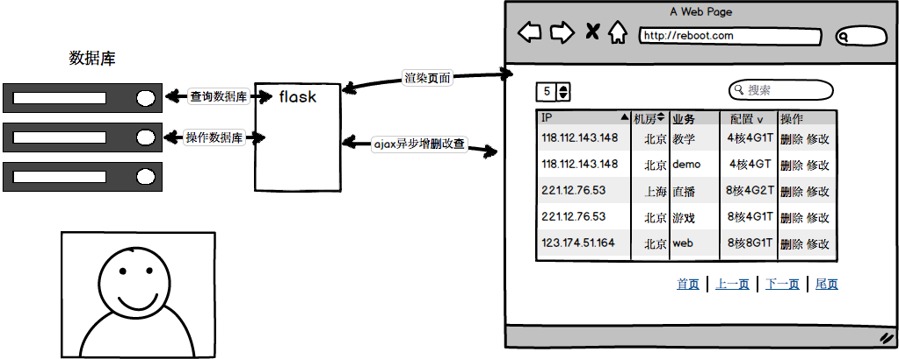
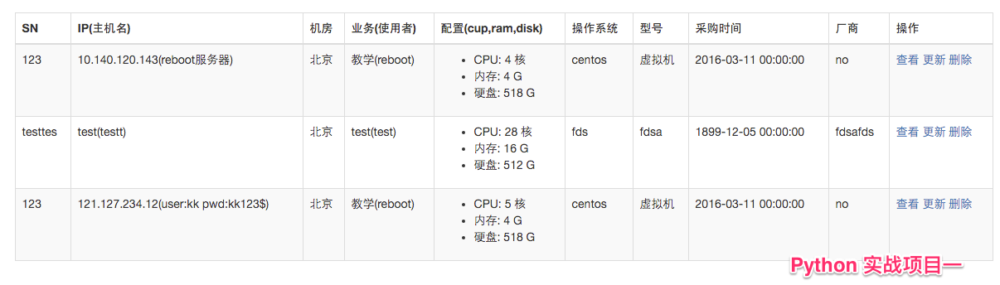
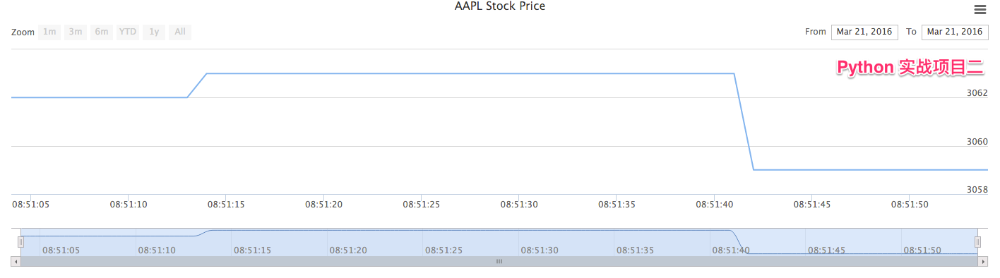

## 学员可完成项目

### 实战班课程升级啦

* 每天一个大战面试官系列，毕业找工作更自信
* 每天打鸡血，鼓励大家坚持到底
* 更新基础的练习和作业，更加贴近实战
* 

###实战项目之一：精简版CMDB

* html+css+js多种前端技术结合
* ajax异步请求操作
* 分页搜索功能应有尽有
* 常见数据库设计原则、CMDB表结构实战、mysql实操
* 独立完成此项目，会对整体的web(LAMP)架构有很好的了解

###实战项目之二（[Nginx日志统计分析与多维可视化](https://github.com/shengxinjing/my_blog/issues/2)）
* 用Python处理Nginx日志文件，进行多维度数据统计分析
* 根据ip、访问地址和访问状态等数据统计，统计结果保存数据库
* Highcharts等流行前端技术多维度将分析结果可视化展示

<!-- log2.gif -->
###实战项目之三（[快速构建实用监控系统](http://blog.51reboot.com/python36-falcon-mon-video/)）
* Python读取机器的实时使用数据，通过http请求将数据入库
* 设计数据入库的api，可以收集不同机器的数据
* 前端将内存数据读出，可视化展示折线图
* 独立完成此项目，对Python常用的time等模块有很好的掌握
<!--  -->

<!-- ### 实战项目之四（主机弹性伸缩）
- 根据日志分析结果设置阀值
- 超过阀值，通过调用api，实现创建或者关闭虚拟机的操作 -->

----

##（一）Python基础
+ Python历史和特点
+ python环境搭建
+ 第一个Python程序
+ Python数字运算
+ Python字符串
+ 变量及变量赋值
+ Python的四则运算、运算符（in、not in、is、and、or）
+ 获取用户输入（input、raw_input）
+ 流程控制
    * 缩进
    * if..else条件语句
    * for while循环语句
    * break continue中断语句
+ 作业1：统计最大的两个值
+ 作业2：统计字符出现次数

##（二）Python列表和元组
              
* 列表的定义
* 列表的循环
* 常见操作（分片、步长、方法）
* 常用内置函数（max、min、range）
* list内置方法(append,pop,count等)
* 列表生成式
* 元组和列表的关系与区别
* 字符串方法（find、join、split、strip、format、replace、
index、count）

* 大战面试官：实现简单的队列和栈
* 大战面试官：冒泡排序讲解

##（三）Python字典和文件处理

                
- 字典的定义和特点
- 字典的增删改查
- 字典的常用内置函数
- 大战面试官：列表的字典的区别和关系，分别适用于什么场景

* 文件IO操作
    - 打开文件
    - 读取文件内容
    - 写文件
* 文件指针的概念
* 作业：编写Nginx日志分析程序
    - （对Nginx日志ip维度进行数据统计）
* 项目目的（日常工作中遇到日志分析应该怎么样全方位的统计）
    - 作业扩展，实际工作中多维度怎么分析

##（四）Python函数编程
* 函数的定义
* 函数的返回值
* 位置参数和关键字参数
* 全局变量和局部变量
* 深入函数定义（可变参数列表、参数列表的分拆、Lambda 形式）
* 理解函数式编程
* Lambda匿名函数
* Sorted排序函数
* 作业：命令行中基于文件存储的登录注册系统

##（五）Web Flask框架

* web框架之争
    - Flask VS Django VS bottle VS tornado
* Python的模块
* web框架Flask介绍
    - 启动app
    - 监听路由
    - 渲染模板
    - 获取网络请求参数
* 简单的html（table、表单）学习
* 作业：基于文件存储的WEB用户登录注册系统（支持增删查）

##（六）数据库基础

* 简单的sql语句学习（增添改查）、数据库建表
* Python执行sql，控制数据库
* 项目1：用Flask实现数据库的增添改查
* 实现目标（可以简单的实现web增添改查功能）
* 项目目的（对Flask、MySQLdb的学习）  
* 将第六天的作业，存储改为mysql

##（七）前端基础

* 前端基础
    - css
    - javascript基础
* 前端学习之jquery
* Ajax调用Python接口
* Bootstrap框架学习
* 作业：对第7天的Flask增删改查提供前端页面，通过web页面对数据库增删改查
* 要求：异步加载数据，不刷新页面

##（八）前端应用实战
+ jquery简介和使用
+ jquery核心模块使用
+ jquery发送异步请求和flask交互
+ 常见jquery插件，实现前端效果
+ datatable，jquery-ui使用
+ ajax异步请求操作

##（九）实战项目之一cmdb

* Python+Flask+Mysql+Jquery+Bootstrap(打通前后端完整流程)
* Flask用户登入
* 项目CMDB系统
* CMDB系统基础信息分析
* CMDB系统资产表设计
* CMDB系统数据展现
* CMDB系统数据更新
* 目的：完整的前端+后端+数据库的项目
* 项目扩展介绍

##（十）Python抽象

+ 类的基本概念与详解
+ 变量与方法
+ 作用域与命名空间
+ 继承
+ 类的抽象、封装、方法与实例化实践
+ 操作数据库封装成类

##（十一）Python常用模块

* 常用内置模块（sys、os、commands）
* 脚本参数处理（sys.argv）
* 时间的控制(time)
* 发邮件模块
* 网络请求requests库
    - 实现爬虫和调用其他http接口

## （十二）实战项目之二（[Python写一个简单的监控系统](http://blog.51reboot.com/python36-falcon-mon-video/)）

* Python读取机器的实时使用数据，通过http请求将数据入库
* 设计数据入库的api，可以收集不同机器的数据
* 前端将内存数据读出，可视化展示折线图
* 独立完成此项目，对Python常用的time等模块有很好的掌握

##（十三）实战项目之三（[Nginx日志统计分析与多维可视化](https://github.com/shengxinjing/my_blog/issues/2)）

* 将Nginx日志处理结果入库
* Flask模板系统，多页面继承
* 前端可视化库的使用
* 常见可视化图形
    - 饼图
    - 折线图等等
* 存储的内存数据可视化
* 项目扩展介绍
 
## （十四）实战项目之四（主机弹性伸缩）
- 根据日志分析结果设置阀值
- 超过阀值，通过调用api，实现创建或者关闭虚拟机的操作

<!-- ## （赠送）Flask扩展
* Flask大型应用的代码组织结构
    * 用包来组织代码介绍。 适用场景分析demo实现，
    * 用蓝图来组织代码介绍。分区结构 VS 功能结构，适用场景分析。demo实现
 -->
* Flask-script扩展。应用场景分析， demo实现
* Flask-SQLAlchemy扩展（ORM）应用场景分析，简单demo实现
* Flask-Migrate扩展,应用场景分析，简单demo实现
* restful api分析及Flask-restful扩展介绍，应用场景分析 ，简单demo实现
