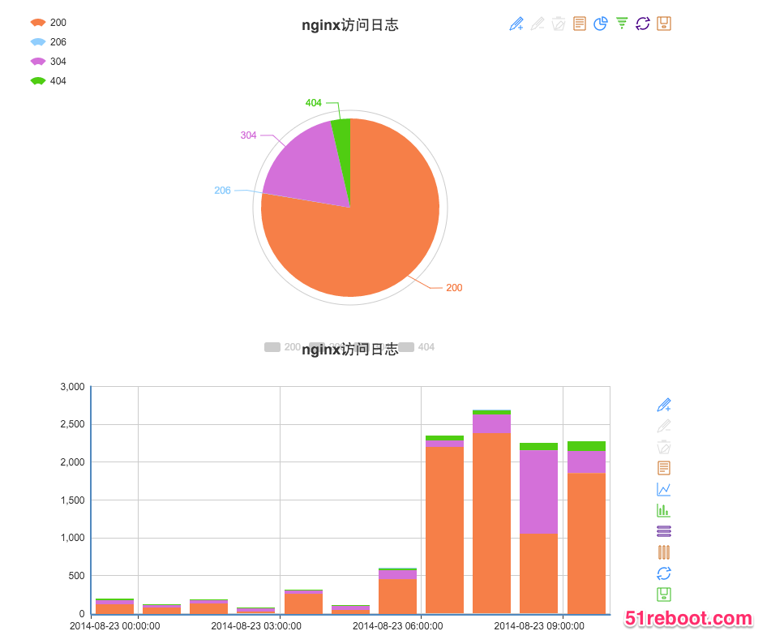

## 学员可完成项目

### 实战班课程升级啦

* 每天一个大战面试官系列，毕业找工作更自信
* 每天打鸡血，鼓励大家坚持到底
* 更新基础的练习和作业，更加贴近实战

### 课程结构图

###实战项目之一：精简版CMDB

* html+css+js多种前端技术结合
* ajax异步请求操作
* 分页搜索功能应有尽有
* 常见数据库设计原则、CMDB表结构实战、mysql实操
* 独立完成此项目，会对整体的web(LAMP)架构有很好的了解

###实战项目之二（[Nginx日志统计分析与多维可视化](https://github.com/shengxinjing/my_blog/issues/2)）
* 用Python处理Nginx日志文件，进行多维度数据统计分析
* 根据ip、访问地址和访问状态等数据统计，统计结果保存数据库
* Highcharts等流行前端技术多维度将分析结果可视化展示

<!--  -->

###实战项目之三（[快速构建实用监控系统](http://blog.51reboot.com/python36-falcon-mon-video/)）
* Python读取机器的实时使用数据，通过http请求将数据入库
* 设计数据入库的api，可以收集不同机器的数据
* 前端将内存数据读出，可视化展示折线图
* 独立完成此项目，对Python常用的time等模块有很好的掌握

<!--  -->

----

## 课程概述
### 面向学员
    * 熟练使用计算机，对Windows、Linux 有一点了解从业职或在校学生
    * 对目前从事互联网运维，想往运维自动化发展的学员，有庞大的开源库 Ansible、Fabric、psutil ... 掌握Python开发非常有利于把运维工作更自动化    * 对目前从事互联网测试，想往自动化测试发展的学员，Python有很多自动化测试的库 Pyunit、doctest、unittest 等等，对自动化测试有很大帮助

## 课程表
### Python 基础部分
####（第一天）基础语法
    * Python 发展历史和语言特性
    * Python 环境搭建及虚拟环境管理
    * 第一个 Python 程序
    * Python 四则运算
    * Python 数据结构
    * Python 元算符（in、not in、is、and、or）
    * 用户输入 （input、raw_input）
    * 流程控制
        * 缩进
        * if..else 条件语句
        * for、while 循环语句
        * break continue 中断语句

    * 作业1：统计最大的两个值
    * 作业2：统计字符出现次数

####（第二天）元祖与列表
    * 列表的定义
    * 列表的遍历
    * 列表的切片
    * 常用内置函数（max、min、range、len）
    * list 方法（append、pop、count ...）
    * 列表表达式
    * 元祖的定义
    * tuple 方法（count、index）
    * 元组与列表的关系与区别
    * 字符串处理（find、join、split、strip、format、replace、index、count ...）
    * 大战面试官1：实现简单的队列和栈
    * 大战面试官2：冒泡排序讲解
    * 作业1：
    * 作业2：

####（第三天）字典与文件处理
    * 字典的定义和特点
    * 字典的遍历
    * dict 方法（get、iteritems、update、keys、values ...）
    * 大战面试官：列表的字典的区别和关系，分别适用于什么场景
    * 文件IO操作
        * 打开文件
        * 文件操作（write、read、readlines、writelines、seek、flush、close ...）

    作业1：IP 维度统计 Nginx 日志
    作业2：工作中遇到日志分析问题，怎么全方面多维度的来统计日志

### Python 进阶部分     
####（第四天）函数式编程
    * 函数在干什么的
    * 函数的定义
    * 函数的返回值
    * 位置参数和关键字参数
    * 全局变量和局部变量
    * 深入函数定义（可变参数列表、参数列表的分拆、Lambda 形式）
    * 理解函数式编程
    * Lambda 匿名函数
    * Sorted 排序函数
    * 作业1：基于文件存储的交互式用户登录注册系统

####（第五天）Flask Web 框架
    * Web 框架之争，囧：PHP是最好的语音
    * 主流框架Flask、Django、Bottle、Tornado 介绍
    * 为什么选择 Flask 作为我们第一个学习的框架
    * Falsk 项目监听、启动、路由
    * 模板渲染
    * 项目的目录结构
    * HTML（table、表单）学习
    * 作业1：基于文件存储的 WEB 用户登录注册系统（支持增删查）

### Python Web 项目开发部分
####（第六天）Python 数据库操作
    * SQL 语句学习
        * 数据的创建、删除
        * 表结构创建、删除、修改
        * 数据的增添改查
    * Python 操作 Mysql
    * 项目1：用 Flask 实现数据库的增添改查
        * 基础功能（可以简单的实现web增添改查功能）
        * 项目目标（巩固Flask、Mysqldb基础知识，把前面的内容融会贯通）
    * 作业1：基于 MySQL 存储的 WEB 用户登录注册系统（支持增删查）

####（八）前端应用实战
+ jquery简介和使用
    * jquery核心概念
+ jquery核心模块使用
+ jquery发送异步请求和flask交互
    - ajax是什么
    - json是什么
+ 常见jquery插件，实现前端效果
    * 模态弹窗
    * sweetalert弹出信息
    * jquery-ui丰富的组件，日期选择、小滑块等
    * datatable美化表格
+ 作业:使用异步ajax+jquery，优化第一天的作业
    - 要求异步，不刷新页面的增删改查

### Web 项目实战部分
####（九）实战项目之一cmdb

* Python+Flask+Mysql+Jquery+Bootstrap(打通前后端完整流程)
* Flask用户登入
    - 登录功能的完善
* 项目CMDB系统
* CMDB系统基础信息分析
* CMDB系统资产表设计
* CMDB系统数据展现
* CMDB系统数据更新
* 目的：完整的前端+后端+数据库的项目
* 项目扩展介绍

####（十）Python抽象和常用模块

+ 类的基本概念与详解
+ 变量与方法
+ 作用域与命名空间
+ 继承
+ 类的抽象、封装、方法与实例化实践
* 常用内置模块（sys、os、commands）
* 脚本参数处理（sys.argv）
* 系统性能（psutil）
* 时间的控制(time)
* 发邮件模块
* 网络请求requests库
    - 实现爬虫和调用其他http接口
* pyquery
    - 解析html，写爬虫必备

#### (十一) 项目一增强实战

* 什么项目是拿得出手的
    - 代码规范
    - 架构设计
    - flask拆分文件
* restful API 和 jsonrpc api使用场景的介绍及demo实现，并完成基于restful API规范实现token的demo
* 讲解运维工单系统的思路及demo实现
* 重点对MVC思想和基于API开发思想进行深入的引导
* nginx+uwsgi+flask部署实战

#### （十二）实战项目之二（[Python写一个简单的监控系统](http://blog.51reboot.com/python36-falcon-mon-video/)）

* Python读取机器的实时使用数据，通过http请求将数据入库
    - 原始获取内存信息方法
    - 使用psutil获取的方法
* 设计数据入库的api，可以收集不同机器的数据
* 前端将内存数据读出，可视化展示折线图
    - 学习可视化神奇Echarts的使用
* 作业：实现简单的监控页面，实时显示监控数据

####（十三）实战项目之三（[Nginx日志统计分析与多维可视化](https://github.com/shengxinjing/my_blog/issues/2)）

* 将Nginx日志处理结果入库
* Flask模板系统，多页面继承
* 前端可视化库的使用
    - echarts深入学习
* 常见可视化图形
    - 饼图
    - 折线图等等
    - 地理可视化
* 存储的内存数据可视化
* 项目扩展介绍
* 作业：实现对访问路径的可视化功能

### 总结与梳理
####（第十四天）
* 前面13天内容的梳理
* 资深面试官面对面，模拟面试
* 如何写一个简洁、突出的简历
* 面试中的软技能
    * 留个面试官一个好印象
    * 如何和 HR 沟通薪资
* 点评学员面试及面试经验的分享
* 职业生涯的指导，做人与做事
#### 赠送
* Ansible 介绍
* Ansible 常用模块介绍（shell、copy、file、cron...）
* Playbook 介绍及应用
* Ansible 二次开发入门

