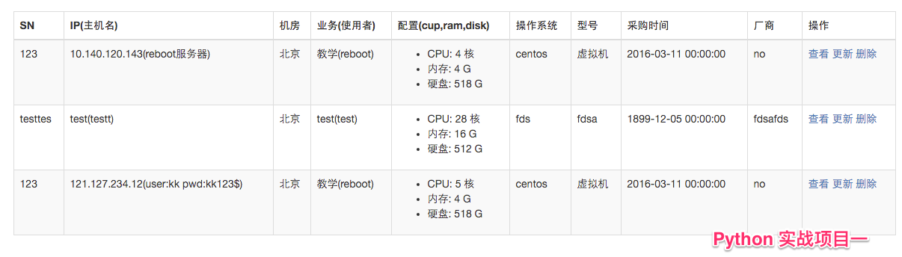
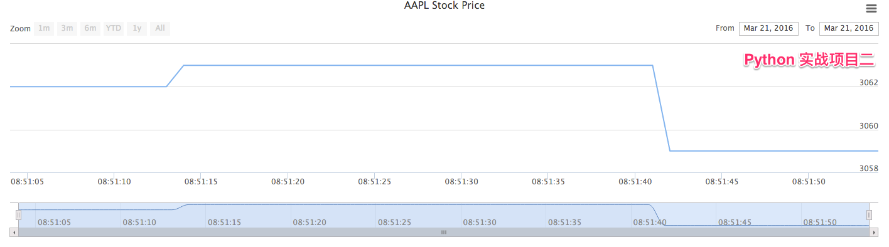
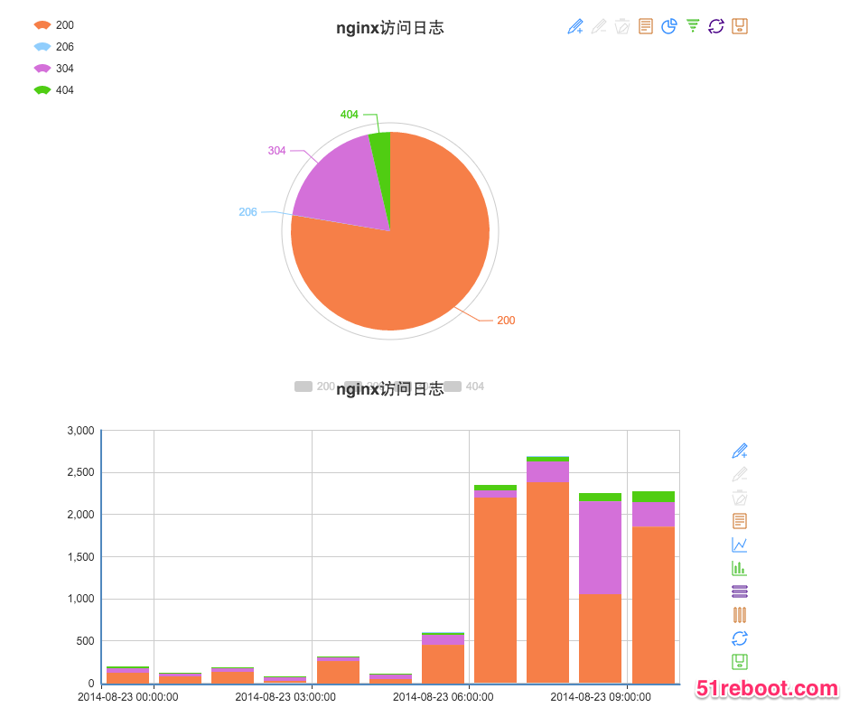

##Python 实战部分

### (一)Python基础
+ Python简介
+ Python的数字，字符串
+ Python流程控制
+ Python循环
+ 列表简介
+ 列表常用函数
+ 基础算法之冒泡排序的实现
+ 实现列表去重的实现

### (二)Python字典 字符串和文本操作
+ 字典简介
+ 字典常用函数
+ 字典和列表的异同
+ 字符串常用操作方法
+ Python文本操作
    * 文件读写操作
    * 统计文件中单词出现次数
    * 对nginx的日志进行分析和数据统计（ip，url等多维度）

### (三)Python函数编程
+ 函数的简介和定义
+ 函数的参数，返回值
+ 函数的作用域
+ lambda匿名函数
+ 常用函数
+ 函数实现简单的递归思想

### (四)Web Flask框架
+ 简单的web介绍
+ 简单的表单标签
+ flask路由，渲染文件
+ flask接收参数

### (五)Python数据库基础
+ 简单的sql学习
+ 用python执行sql语句
+ 前端实现操作数据库

### (六)前端基础
+ 前端内容简介
+ html常用标签
+ css常用属性
+ css流行框架之bootstrap
+ javascript语法简介
### (七)前端应用实战
+ jquery简介和使用
+ jquery核心模块使用
+ jquery发送异步请求和flask交互
+ 常见jquery插件，实现前端效果
+ datatable，jquery-ui使用
 

### (八)实战项目一，Python+Flask+Mysql+Jquery+Bootstrap(打通前后端完整流程)
+ 完整的增删改查
+ 友好的交互
+ 登录验证
+ 
### (九)Python（面向对象编程、常用模块、Flask扩展）
+ 面向对象思想介绍
+ python实现类
+ python实现类的继承
+ 实现小游戏，深入理解面向对象
+ python其他常用模块 os,sys,time等
+ flask大型项目代码组织结构
+ flask常用扩展script、sqlalchemy等

### (十) 计算机基础之数据结构和算法介绍
+ 数据结构和算法的关系
+ 算法的评判标准
+ 排序算法(冒泡和快排)
+ 查找算法
+ 栈和队列
+ 链表和树
+ 图的简介
+ 深度优先搜索和广度优先搜索的简介

### (十一)Pythoin多进程，多线程编程：

+ 多进程多线程的产生，在Linux系统中的地位
+ 多进程和多线程的选用场景
+ 多进程、多线程基础；为什么不能一味的开线程解决问题
+ 协程简介
+ 程序运行时的内存布局
+ 从系统底层看Python的多进程、多线程实现，分析GIL
+ 守护进程，用Python实现一个守护进程

### (十二)Python实战项目二(简易版监控系统)
+ Python读取文件，实时获取内存
+ 内存信息入库存储
+ 前端获取信息，使用html5的canvas库可视化展现
+ 

### (十三)Python实战项目三(日志可视化)
+ 多台Web机器日志分析、汇总、生成报表、邮件定时发送报表信息
+ 之前做的日志分析数据入库，多台机器数据汇总
+ 生成报表和可视化
+ 定时汇总发送邮件
+ 

  

### (十四)Python实战项目四
- 云主机弹性伸缩
- 根据日志分析结果设置阀值
- 超过阀值，通过调用阿里云的api，实现创建或者关闭虚拟机的操作

