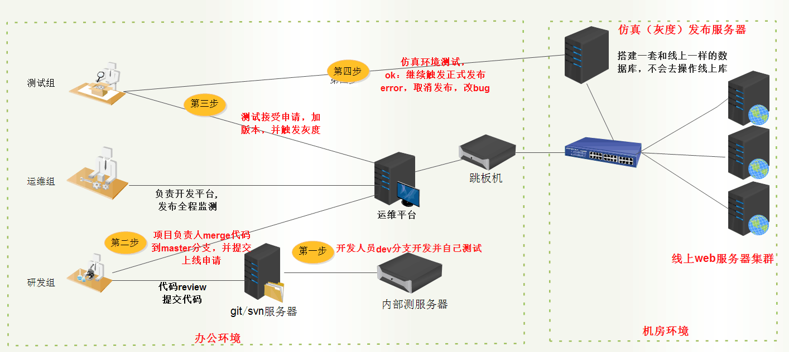
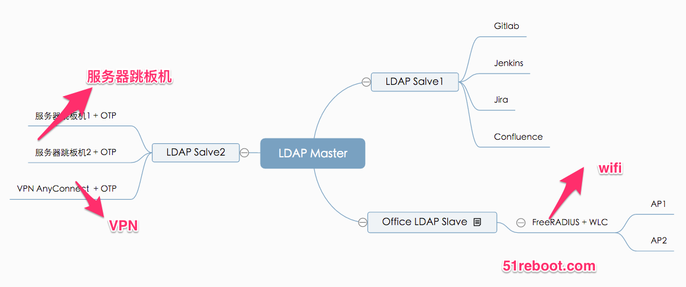
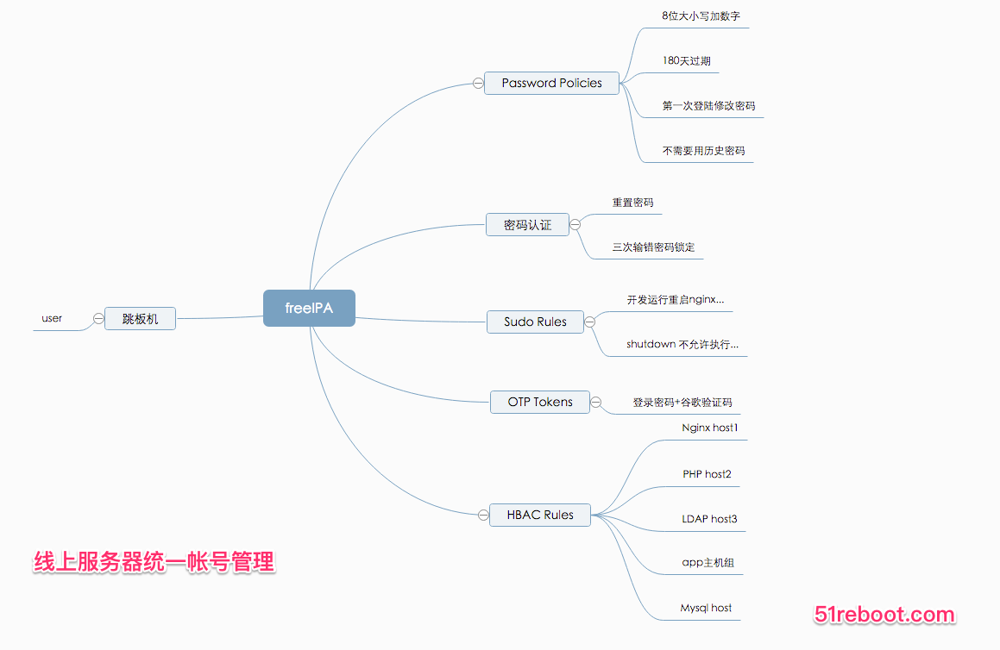

## 自动化实战部分
* 企业开发规范技巧
    * 代码规范（变量、函数、类命名、日志、异常处理）
    * Debug 技巧（性能调优、怎么快速定位错误）
    * 开发常见安全问题（SQL注入、XSS）
    * Git 开发流程规范（协作开发、commit、分支、Tag）

* (一)自动化实战项目一
    * 从无到有怎么设计一个可用的 CMDB
    * 企业级 CMDB 系统 API 设计与实现
    * 企业级 CMDB 表结构设计思路
    * CMDB 与资源管理平台联动
    * CMDB 与 Zabbix打通 API 封装

* (二)自动化实战项目二(企业级Zabbix自动化)
    * 主机自动发现同步
    * 对 Zabbix 主机进行批量操作（绑定模板、解绑模板、维护主机）
    * 对 Zabbix 数据二次开发
    * SlatStack 批量管理 zabbix 监控脚本

* (三)自动化实战项目三(性能展示平台)
    * 业务应用展现
    * 硬件故障展现
    * Nginx、PHP性能监控
    * 系统层（CPU、内存...）横向、纵向历史数据对比展现
    * 故障处理时间、处理人、报警历史展现

* (四)自动化实战项目四(流程工单系统)
    * 主流规范介绍
    * 组织架构与权限审计
    * 服务器资源申请
    * 线上机器权限申请
    * git、svn、新项目申请

* (五)自动化实战项目五(发布系统)
    * 发布流程设计
    * 发布状态管理
    * Ansilbe API开发与业务场景应用
    * 代码推送（测试发布、灰度发布、全网发布）
    * 代码回滚
    * 上线记录及版本版本展示
    * 

* (六)自动化实战项目六(用户权限平台)
    * RBAC权限管理系统
    * 企业级LDAP用户管理（自动化平台、Git、Jenkins、Jira、Confluence打通）
    * 找回密码、弱密码检查
    * 企业无线认证（可扩展）
    * 

* (七)自动化实战项目七(服务器管理平台(freeIPA))
    * 帐号密码复杂度
    * sudo 权限控制
    * 项目运行权限
    * 密码+谷歌认证验证码
    * 

* (八)自动化实战项目八(企业云平台)
    * 阿里云、AWS API封装
    * 微信服务号API接口开发（微信报警）
    * 第三方CDN API接口开发（访问数据展现、内容刷新）

